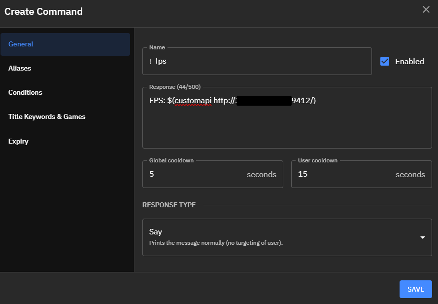

## PublicFPS
"Real-time" Minecraft FPS counter service

> This addon is only available for LabyMod 4

## Install (Server)
1. Clone the repository (`git clone https://github.com/GradientTim/labymod-publicfps-server` or download the zip file)
2. Install [Bun](https://bun.sh) to start the server
3. Generate a secure `authToken` in the `index.ts´ file (You can use the tool from [LastPass](https://www.lastpass.com/features/password-generator#generatorTool))
4. Run `bun index.ts` in the directory where you have cloned the repository

> If the `bun.lockb` is missing (for whatever reason), execute `bun i` before the `bun index.ts` command

> I know it sounds stupid, but: Make sure that the host on which you install it is publicly accessible. (At least the port `9412`)

## Install (Addon)
1. Download the JAR file from the releases page (on your right)
2. Goto `%appData%/.minecraft/labymod-neo/addons/` and put the downloaded JAR file into it
3. (Re)start LabyMod and click on `Options -> LabyMod -> PublicFPS`
4. Make sure to enable the addon and configure the `URL` and `Secret Token` (Secret Token = AuthToken)
5. You're done. Open the website `http://localhost:9412` and you will see a number - that's your in-game FPS :-)

### Why not uploading to FlintMC?
The addon serves more as a fun addon and should not appear publicly in the addon list

### Local server hosting?
It is possible to host the server on your computer if you use a tunnel service such as [ngrok](https://ngrok.com/)
 All you have to do is execute the following command: `ngrok http 9412`

### Why does this addon exist?
If a viewer in your stream asks for the in-game FPS number and can't read your HUD, you can add this command to [Fossabot](https://fossabot.com/)

Variable: `$(customapi http://localhost:9412/)`